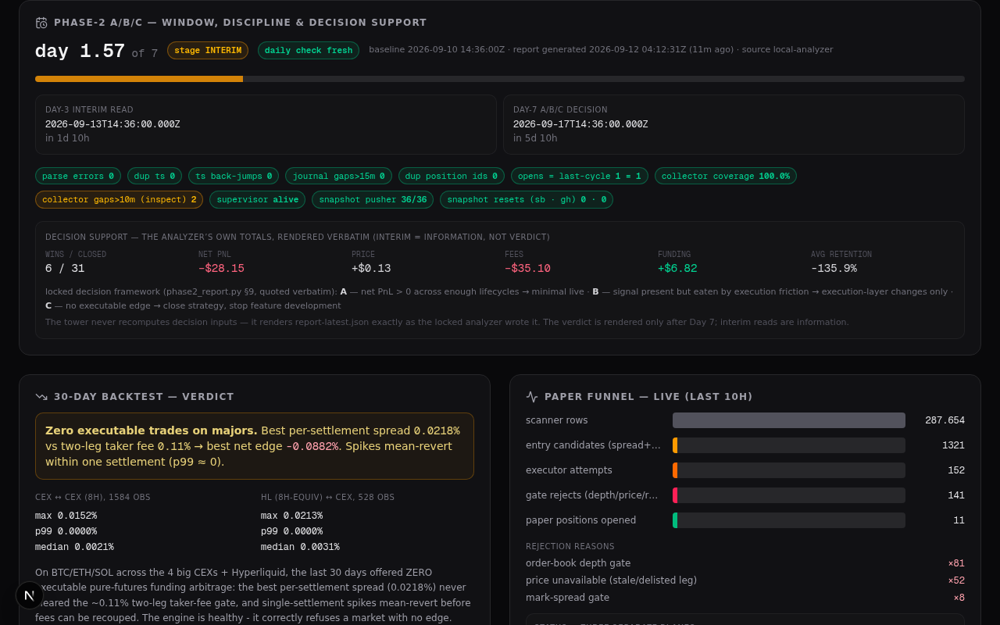

# funding-arb · command center (tower)

[](https://github.com/markec12345678/funding-arb-tower/actions/workflows/ci.yml)

Live operations dashboard with **two views on one page**: the **live monitor** for the
[funding-arb](https://github.com/markec12345678/funding-arb) paper-validation pipeline
(backtest verdict, paper-trading funnel, runner health, delivery pipeline, phase-3 safety
certification, the **Phase-2 A/B/C window & discipline card** — 10 s refresh) and the
**quant engine view** — a read-only monitor of the
parallel [`quant-arb-engine`](https://github.com/markec12345678/quant-arb-engine) research
repo (multi-seed machinery validation, ALL-IN EDGE waterfall, NO-GO discipline).


*Built with Next.js 16 (App Router) · TypeScript · Tailwind CSS 4 · shadcn/ui.
Deployable to Vercel with zero configuration and zero environment variables.*

---

## The system it watches

This dashboard is one of four coordinated repositories:

| repo | role | state |
|---|---|---|
| [`funding-arb`](https://github.com/markec12345678/funding-arb) | the trading system — scanner, strategy, executor, gates | **locked** at `0373f5d` during Phase-2 A/B/C paper validation (539 tests, CI green) |
| [`phase3-lab`](https://github.com/markec12345678/phase3-lab) | execution-safety laboratory — 4-layer separation, formal safety gate | **certified**: 106/106 tests (foundation 80 · reconciliation 19 · risk guardian 23 · cross-layer 13), golden contract v1.1.0, PORT CANDIDATE — port blocked by Phase-2 verdict |
| [`quant-arb-engine`](https://github.com/markec12345678/quant-arb-engine) | next-gen research engine — invariant-first market-data model, ALL-IN EDGE waterfall, TWO carry families (forward lock + perp float) ranked every quote day on a deterministic mock RFQ world, PLUS the W0 real-RFQ ingestion lane (immutable hash-chained raw journal + adapters) and the W1-INFRA journal replay adapter + coverage census | **v0.6.5 · paper/research only** — W0: real RFQ ingestion shipped (15-field schema, R-1…R-13 fail-closed invariants, source wall real\|synthetic, file/webhook adapters with `--dry-run` first-contact validation that writes nothing, deterministic ALL-IN EDGE accounting — descriptive only; webhook receiver hardened v0.6.4: every accepted record refreshes `rfq-status.json` so this tower stays live on the always-on path, honest stale/500 response surfaces); W1-INFRA: the journal replay adapter (W0 records → typed quotes with provenance; funding/settlement surfaces honestly refused — no estimator smuggled through infrastructure) + the coverage census (one command answers what the journal supports — families, eligibility breakdown, day/tenor coverage; the inclusion criteria the future W1 sealed record will cite); the first-feed day is rehearsed end-to-end on stand-in data (engine runbook + executable dress rehearsal, zero repo writes); invariant-checked by 103 tracked checks reproducible from the repo via `verify_w0_invariants.py` — now also the CI gate on GitHub on every push (whole-tree byte-compile + the same 103-check harness on runners); 0 real records until a feed is connected; on top of v0.5.0 (adverse-side horizon σ, holdout ladder, quadruple panels, P1..P5 all SUPPORTED); monitored read-only from this tower's engine view |
| **funding-arb-tower** (this repo) | command center — reads both pipelines, never trades | runs sandbox-local and/or deployed · **CI on every push** (typecheck strict zero-errors + lint — the same discipline as the sibling repos' gates) · the delivery-pipeline card watches the family's gates **live** — funding-arb CI (the locked repo's, re-validated nightly on the frozen sha), its own CI, and the engine's 103-check harness CI, all three as real-time GitHub queries; phase3-lab is shown as the static certification artifact it is (no CI, deliberately — the certificate is a frozen historical fact, not a liveness gate) · render failures degrade to an honest retry boundary, never a white screen |

The validation ladder the dashboard reflects:

```
P0 hardening ✓ → 30d backtest ✓ (0 trades, fee gate) → E2E paper-flow ✓
  → Phase 2: paper validation A/B/C          [ACTIVE — day-3 interim, day-5–7 final]
  → Phase 3: execution-safety lab            [CERTIFIED — cross-layer gate green]
  → production port of the safety layer      [BLOCKED by Phase-2 A/B/C]
  → minimal real-money test                  [pending everything above]
```

## Two data modes — one payload

`GET /api/status` returns the **same payload shape** from two very different
data planes, chosen automatically:

| | `mode: "local"` (sandbox) | `mode: "remote"` (deployed) |
|---|---|---|
| funnel (liveness plane) | read directly from the `/home/z/funding-arb` checkout (sandbox runner) | **live collector cycles** from `paper-data/github-actions/journal.jsonl` (updated every ~5 min) |
| ledger · exits · economics (evidence plane) | the same checkout, read live per request | **hourly sandbox snapshot** at the `paper-data` branch root (journal + ledger — the experiment's truth, up to ~1 h stale, age labeled on the cards as `paper.evidence`) |
| backtest · runner log | local files | hourly lifecycle snapshot at the `paper-data` branch root |
| **phase-2 discipline** | `scripts/data/phase2/report-latest.json` — the read-only analyzer's stable artifact, read verbatim | `paper-data/phase2-report-latest.json` — shipped hourly by the tower-owned snapshot pusher |
| runner liveness | `pgrep` + pidfile + log mtime | freshness of the collector's newest cycle on the branch |
| repo commits | local `git log` | GitHub REST API |
| latency | ~50 ms | cold ~1–6 s, then cached (60 s raw / 300 s API TTL, ETag revalidation) |

The mode is shown in the UI (`sandbox live` / `github branch` badge) and can
be forced for verification — on the API or on the whole page:

```bash
curl "http://localhost:3000/api/status?source=remote"   # API payload
open "http://localhost:3000/?source=remote"              # full dashboard in remote mode
```

The GitHub API client uses ETag conditional requests — 304 responses are free
against the rate limit — and optionally picks up a PAT from the funding-arb
git remote at runtime (sandbox only). Deployed, it runs fully unauthenticated
against public data: **no environment variables, no secrets in this repo.**

**Ledger coverage:** the positions table payload is the **last 20 ledger
rows** (bounded payload for the 10 s poll), but the whole-file counts live in
`paper.ledger {total, open, closed}` — the runner appends rows in open order
and updates status in place, so an open position's row slides out of the tail
as the ledger grows. The "paper positions" KPI and the ledger card's coverage
label read `ledger.open`, never the slice: an open position outside the tail
is still open, still counted, still labeled.

**Evidence-plane consistency:** the A/B/C evidence cards (ledger · exit
classification · economic decomposition) always read the **experiment's**
data — the sandbox runner's journal + ledger. In local mode those are the
live files; in remote mode the hourly snapshot at the branch root (the
collector is a parallel stateless funnel, deliberately NOT the evidence
source — its positions file is its own funnel view, not the runner's
ledger). `paper.evidence {plane, age_s}` declares which — the cards label
the snapshot age in remote mode, so a stalled hourly push is visible on
the evidence itself, not only in a freshness field.

### How the remote data stays fresh

```
sandbox paper runner (5-min cycles)
   └─ journal.jsonl / positions.json ── hourly snapshot push ──► paper-data/ (branch root)
github-actions collector (repository_dispatch heartbeat, every 5 min)
   └─ live cycles + positions ─────────────────────────────► paper-data/github-actions/*
daily verify-only check (phase2_report.py, read-only analyzer)
   └─ report-latest.json ──────────── hourly snapshot push ──► paper-data/phase2-report-latest.json
funding-arb-tower (deployed)
   └─ funnel from the collector files (live, liveness plane),
      ledger + exits + economics + backtest + log + phase-2 discipline
      from the hourly snapshot (evidence plane — same numbers as the
      sandbox, up to ~1 h stale, age labeled)
```

### Staleness gate (why green means the data is live)

The pipeline's weakest point is that its liveness depends on *other* things
running: the sandbox runner, the github-actions collector, and — for the
[Vercel demo](https://funding-arb-dun.vercel.app) — an **external**
cron-job.org trigger. If any of them dies, every box can still look green
while serving stale data. The dashboard therefore never infers health from
process state alone:

- `freshness.data_age_s` — the age of the **newest data point** (newest
  journal cycle). A new cycle is expected every 5 min; after 15 min without
  one the whole status pill goes **RED** (`data stale · Xm old`) even while
  the runner pid still exists. No data at all → `unknown`.
- `freshness.lifecycle_age_s` (remote) — age of the hourly sandbox lifecycle
  snapshot, tracked separately.
- `pipeline.snapshot.age_s` — age of the `gh-pages` scanner snapshot that
  feeds the Vercel demo (hourly, external cron). Stale → a red
  `SNAPSHOT STALE` badge — this is the detector for a dead cron-job.org
  schedule.
- `supervisors` (local) — the tower's own background lanes surfaced live in
  the paper card: the **5-min paper-collector dispatch** (heartbeat state read
  from the append-only `gh_heartbeat.log`), the **hourly paper-data
  lifecycle push** (its own meta file) and the **daily phase-2 verify-only
  analyzer run** (automated by the `phase2-daily` lane — previously the daily
  check ran only when an operator session happened to be active, a discipline
  single-point-of-failure; the lane seeds from the existing report on first
  activation, runs at most once per 24 h, retries after 1 h on failure), each
  with its verbatim last result, age and cadence. Why: an expired PAT kills
  the remote lanes with every dispatch returning 401 and every push failing —
  while the local funnel keeps cycling and every other card stays green. The
  dispatch lane degrades to `DOWN`, a result-ok-but-old lane to `LATE`, token
  death becomes visible in minutes (verified by induction: a mocked 401
  result renders the exact red state). Remote mode shows an honest
  sandbox-only note instead — the meta/log files are deliberately not pushed
  to the branch, and the remote plane already tracks the same lanes
  end-to-end via the branch & lifecycle ages.

Verified both ways: lowering the thresholds makes a live-runner dashboard go
red immediately; restoring them returns it to green.

## What runs where

The repo is **portable by construction** — every sandbox-only duty is guarded
by an `existsSync("/home/z/funding-arb")` check and degrades to a no-op
elsewhere:

- `src/instrumentation-node.ts` — **paper-runner supervisor** (sandbox only):
  re-spawns the Python paper runner if it dies, records supervisor state.
  On Vercel: imported, guard fails, nothing happens.
- `src/server/gh-heartbeat.ts` — fires a `repository_dispatch "paper-cycle"`
  at GitHub at most every 5 min so the stateless github-actions collector
  runs on GitHub's own runners (sandbox only).
- `src/server/paper-snapshot.ts` — hourly durability push of the lifecycle
  dataset (journal, positions, config, logs, **and the phase-2 analyzer's
  report-latest.json**) to the `paper-data` branch via
  git plumbing — the funding-arb working tree is never touched (sandbox only).
- `src/server/phase2-daily.ts` — the daily Phase-2 verify-only check lane
  (sandbox only): runs the locked read-only analyzer at most once per 24 h,
  retries after 1 h on failure, and seeds from an existing report so a fresh
  activation does not double-run the same day (lane health surfaces in the
  paper card's supervisor rows).
- `src/app/api/status/route.ts` — the status API (both modes, see above);
  its `supervisors` dict is FOUR lanes — heartbeat, snapshot, phase2, and the
  dev-server watchdog (Task 63: the watchdog row's healthy predicate mirrors
  recon's degrade predicates exactly — loop fresh ≤ 120 s, consecutive
  failures < 3 — so the UI and the operator's recon never disagree; honest
  blind spot documented in the route: the row renders FROM the server, so
  during a full outage recon is the surface that still reports).
- `src/app/api/engine/overview/route.ts` — the quant-arb-engine monitor API (read-only;
  local sandbox checkout → GitHub raw fallback, 60 s remote cache).
- `src/app/page.tsx` — the dashboard (client component, 10 s polling) with the
  monitor/engine view switcher.
- `src/app/error.tsx` + `src/app/global-error.tsx` — error boundaries: a
  render failure in any view degrades honestly ("the measured systems are
  unaffected — the tower is read-only") with a retry, instead of a
  white-screen; verified by inducing a real render error and recovering.
- `src/components/quant-engine/EngineView.tsx` — the engine view (60 s polling).
- `src/lib/engine-types.ts` — the engine artifact contract (shared by API + view).
- `scripts/push-paper-snapshot.sh` — the plumbing-based snapshot pusher.
- `scripts/recon.sh` — **operator recon**: the canonical round-start state check
  (read-only: localhost API + file reads + `git -C`; never writes, never
  spawns, never trades). Encodes the paths operators kept re-deriving from
  memory — the tower repo lives at `/home/z/my-project` (there is no
  `/home/z/funding-arb-tower` directory), the status API key is `supervisors`
  (a dict of four — heartbeat/snapshot/phase2/watchdog lanes + `reason`,
  which is not a lane), the lane metas live in the
  locked repo's `data/` (the watchdog's meta is tower-local,
  `my-project/data/`). Checks repo states incl. the funding-arb lock sha,
  runner liveness, the three live CI lanes, freshness, supervisor lanes,
  phase-2 day/stage/countdowns (next lane fire mirrors `phase2-daily.ts`'s
  tick gate — update both in one commit if the gate changes), the dev-server
  watchdog, and the paper summary with EVERY coverage labeled (Task 61:
  journal-window totals carry the window line — from/to, span in hours, and
  the sliding warning that these counts DROP as lines age out — positions
  say `(whole ledger)`, economics says `(experiment-lifetime)`; mixed
  coverages never share a section unlabeled). Plus the **lane-report
  invariant** (Task 68): a lane fire that ended `ok` must show
  `report-latest.generated_at ≥ lane.last_run` — catching "analyzer
  exited 0 but the report was not rewritten" the same morning instead
  of waiting out the 26 h `check_overdue` grace (seeded state is exempt
  by construction). The PAPER RUNNER meta line is equally honest about
  missing records: `last_spawn=0` renders as `none recorded` (never
  epoch-zero 1970 next to a nonzero respawn counter — the supervisor
  now carries the spawn timestamp across boots like its counter; the
  pre-fix resets lost the pre-Sep-12 record, and the runner's own
  printed uptime still dates the current process). Exit `0` = all
  green, `1` = degraded with named reasons; failure paths (dead API, lock
  drift) verified by test, not assumption.
- `scripts/e2e.sh` — **browser-level golden path**: recon's sibling for the
  delivered UI. One command drives a real headless browser through what every
  round used to verify by hand — open the page, **assert the DEFAULT engine
  landing renders with live data and its own honesty labels** (Task 57: view
  hint, `sandbox live` mode chip, `all data synthetic` + `paper only` + the
  binding NO-GO strip, the W0 real-RFQ card with `source wall` + `chain
  intact`, engine-view layout at 1440/390 — `/api/engine/overview` ignores
  `?source`, so both runs read the same engine plane), click past to the
  live monitor, wait for live data, assert the monitor cards render in BOTH
  data modes (local live-files vs `?source=remote` snapshot plane), the Task
  52/53/54 coverage/evidence labels are present (and ABSENT in local — mode
  purity) — including the funnel's `· Xh window` sliding-journal label
  (Task 61: windowed counters DROP as journal lines age out; the assertion
  keeps the label from being dropped), the scope-guard labels (Task 56: "Diagnostic only — NOT a
  Phase-2 PnL instrument" on economics, "never a single blended PnL" on
  exits — machine-checking the R7 scope guard), zero console/page errors, no horizontal overflow at 1440 and 390,
  and the sticky-footer contract. Preflight refuses to run under thin memory
  or with stray browser sessions (both learned from a real OOM that killed
  the dev server mid-verification — see `scripts/e2e.sh`'s header for the
  three shell-level traps the ordering/greps encode: hydration-gated click,
  case-sensitive text matching, and the `pipefail` + `grep -q` SIGPIPE race).
  Exit `0` = golden path green, `1` = needs eyes. `--shots` additionally
  writes `screenshots/e2e-{mode}-{viewport}.png` as round evidence. Bodies
  are staged to `/tmp/e2e-body-*.txt` for post-hoc diagnosis of any text
  assertion failure.
- `scripts/interim.sh` — **the decision-grade experiment readout**: the
  third sibling (recon = system health, e2e = delivered UI, interim =
  what the experiment SAYS). One read-only command for the Day-3 interim
  read and the Day-7 A/B/C decision: experiment day + decision countdowns,
  report/lane freshness (next fire mirrors `phase2-daily.ts`'s own logic),
  **the trend across every archived analyzer report** (day · closed · W/L ·
  net · retention · funding · fees — the trajectory no single report can
  show), the current decision-support block in the analyzer's own locked
  framework, the ledger in BOTH coverages labeled (report-day closes vs
  live whole-ledger — Task-52 discipline), and integrity (latest verdicts
  + an all-archive scan + totals-vs-Σpnl self-consistency). The archive's
  own archaeology is stated, not smoothed over: the two earliest reports
  predate the locked analyzer's semantics (pre-standardization fields,
  pre-baseline-scoped gap lists) — footnoted at the trend, never silently
  normalized. Writes nothing; funding-arb stays LOCKED @ 0373f5d, 0-dirty.
  Exit `0` = read produced · `1` = no readable report yet.
- `scripts/dev-server-watchdog.sh` — **dev-server watchdog**: the outer ring
  of the mutual-protection pair. Everything autonomous in this sandbox (the
  paper-runner supervisor, gh-heartbeat, snapshot pusher, phase2-daily lane)
  lives INSIDE the dev server — which nothing supervised until the OOM
  incident (Task 55) proved that gap real. The watchdog, orphaned to PID 1
  OUTSIDE next-server, probes port 3000 every 15 s and respawns `bun run dev`
  with the subshell-orphan recipe when it dies (measured end-to-end: ~75 s
  from SIGKILL to HTTP 200, unattended). The other half of the pair: the
  instrumentation ensure-block (`src/instrumentation-node.ts`) spawns the
  watchdog at every dev-server boot if absent — proven to fire 1 s after
  boot and to produce a watchdog that SURVIVES its parent server's death
  (detached children reparent to init, same as the runner during the OOM).
  Semantics: single-instance via `flock` (kernel-level — a pgrep-based guard
  false-positived on the invoking shell's own argv on the first start);
  3-miss death detection; a 90 s boot grace so a slow-but-healthy boot is
  never killed mid-bind; first failure respawns immediately, repeated quick
  failures back off (120 s, then 600 s at ≥5); re-probe after backoff so an
  operator's manual recovery is never superseded. State in
  `data/dev_server_watchdog.meta.json` + `data/watchdog.log`, surfaced by
  recon's DEV-SERVER WATCHDOG section (which reads local files ON PURPOSE —
  it still reports during the outage the watchdog is fixing). Honest scope:
  a simultaneous death of BOTH pair members needs the manual recipe below
  (one command — and the fresh boot re-arms the pair); a hung-but-alive
  server and a full sandbox reboot stay manual/out of scope.

## Quickstart

```bash
bun install
bun run dev        # http://localhost:3000
bun run lint       # eslint
bun run typecheck  # tsc --noEmit — strict, zero errors (what CI enforces)
```

CI (`.github/workflows/ci.yml`) runs on every push/PR to `main`:
`bun install --frozen-lockfile → prisma generate → typecheck → lint`.
The typecheck covers exactly what deploys — `examples/` and `skills/` are
scaffold reference code the Next build never touches and are excluded.

Operator state check (any time, read-only):

```bash
scripts/recon.sh   # exit 0 = all green · exit 1 = degraded (reasons listed)
```

Browser-level golden path (dev server up, ~10 s):

```bash
scripts/e2e.sh            # exit 0 = golden path green in both data modes
scripts/e2e.sh --shots    # … plus screenshots/e2e-*.png as round evidence
```

Decision-grade experiment read (any time, read-only):

```bash
scripts/interim.sh        # the Day-3/Day-7 read: trend + decision support
```

### Dev-server recovery & the watchdog pair (sandbox only)

The dev server is normally self-healing: `scripts/dev-server-watchdog.sh`
(kept alive by the instrumentation ensure-block at every server boot) probes
port 3000 every 15 s and respawns the server within ~75 s of its death —
verified end-to-end by three controlled tests (server kill → auto-respawn;
both killed → manual boot re-spawns the watchdog; watchdog surviving its
parent server's death and recovering it again). `scripts/recon.sh`'s
DEV-SERVER WATCHDOG section shows its state; `data/watchdog.log` is its
action log.

The manual recipe below is for the ONE case the pair cannot cover: both
members dead at once (or a fresh sandbox bootstrap). It is the subshell-
orphan pattern — and the boot it produces re-arms the pair automatically:

```bash
cd /home/z/my-project && ( setsid nohup bun run dev >> dev.log 2>&1 < /dev/null & )
```

The parens matter: processes spawned inside a tool call are reaped when the
call ends, and plain `setsid … &` loses that race — the subshell exits
immediately, bun is orphaned to PID 1 *during* the call, and the reaper's
descendant walk misses it. Verify with `curl localhost:3000` in the NEXT
tool call, then `scripts/recon.sh` (the supervisor lanes re-arm from their
file-based metas; the runner is a separate process and keeps cycling
throughout).

Two footguns encoded in the watchdog (both learned by test, not theory):
manual restarts during a watchdog backoff window may be superseded (the
watchdog re-probes before killing, so a bound server is left alone — stop
the watchdog first if you need full manual control), and never start a
second watchdog instance by hand — `flock` makes the duplicate exit
immediately, but the surviving instance's start time is then not what you
expect.

Copy `.env.example` to `.env` if you want the (unused-by-this-app) Prisma
datasource wired up.

## Deploy to Vercel

1. Push this repo to GitHub (or fork it).
2. In Vercel: **Add New → Project → import the repo**.
   Framework preset **Next.js** is auto-detected; the build command is a
   plain `next build` — no environment variables needed.
3. Open the deployment: the dashboard comes up in `remote` mode
   (GitHub-branch data plane — live collector cycles) because no
   `/home/z/funding-arb` checkout exists on the serverless runtime.

That is the whole setup — the remote mode is read-only over public GitHub
data, so there is nothing to configure and nothing that can leak.

## API

### `GET /api/status[?source=remote]`

Example values below are illustrative (`12345`, `42`, …) — the real payload
carries live runtime numbers.

```jsonc
{
  "now": "…ISO…",
  "mode": "local" | "remote",
  "source": { "kind": "sandbox-live" | "github-branch", "detail": "…" },
  "freshness": {                      // the staleness gate — see above
    "data_age_s": 42,                 // age of the NEWEST journal cycle
    "expected_cycle_s": 300,
    "stale_after_s": 900,
    "stale": false,
    "status": "fresh",                // fresh | stale | unknown
    "branch_age_s": null,             // remote: paper-data tip age
    "log_age_s": 480,                 // local: runner log age
    "lifecycle_age_s": null           // remote: hourly snapshot age
  },
  "repo":   { "branch": "main", "commits": [ { "sha": "0373f5d", "message": "…" } ], "dirty": false },
  "paper": {
    "runner":  { "alive": true, "pid": 12345, "log_updated_at": "…", "log_tail": ["…"], "supervisor": { } },
    "cycles":  [ { "ts": "…", "scan_total": 2419, "candidates": 5, "opens": 1, "open_simulated": 0, "open_aborted": 1, "open_positions": 6 } ],
    "aborts":  [ { "reason": "order-book depth gate", "count": 12 } ],
    "totals":  { "cycles": 42, "scan_total": 101530, "…": "…" },
    "window":  { "lines": 120, "from": "…first counted cycle…", "to": "…last counted cycle…" },  // what totals cover — KPI labels derive from this, not an assumed duration
    "ledger":  { "total": 45, "open": 3, "closed": 42 },  // whole-file ledger counts — positions[] is only the last 20 rows
    "evidence": { "plane": "sandbox-snapshot", "age_s": 1892 },  // remote: evidence cards read the hourly snapshot (age labeled); local: "sandbox-live"
    "positions": [ { "id": "…", "base": "RVN", "long_venue": "binance", "short_venue": "bybit", "status": "open" } ]
  },
  "backtest": { "fee_gate": { "best_spread_pct": 0.0218, "…": "…" } },
  "phase2": { "day": 1.67, "stage": "INTERIM", "…": "…",
              "trajectory": { "available": true,
                               "source": "paper-data branch — every distinct report version",
                               "points": [ { "sha": "…", "day": 1.567, "stage": "INTERIM", "net": -28.15, "wins": 6, "closed": 31, "retention": -135.9, "generated_at": "…" } ] } },
  "pipeline": {
    "github":  { "repo": "markec12345678/funding-arb", "pushed_at": "…" },
    "funding_ci": { "repo": "markec12345678/funding-arb", "latest": { "sha": "0373f5d", "status": "completed", "conclusion": "success", "completed_at": "…" }, "summary": "pytest 539 (ubuntu+windows matrix) + docs-sync · …" },
    "tower_ci": { "repo": "markec12345678/funding-arb-tower", "latest": { "sha": "8aeb5d3", "status": "completed", "conclusion": "success", "completed_at": "…" }, "summary": "typecheck (strict) + lint" },
    "engine_ci": { "repo": "markec12345678/quant-arb-engine", "latest": { "sha": "e0acfaf", "status": "completed", "conclusion": "success", "completed_at": "…" }, "summary": "compileall + 103-check invariant harness" },
    "phase3":  { "latest": { "sha": "5581abc", "message": "…" }, "tests": "106/106 (…)", "status": "cross-layer CERTIFIED — port candidate BLOCKED by Phase-2 A/B/C" },
    "vercel":  { "url": "https://funding-arb-dun.vercel.app", "healthy": true },
    "snapshot":{ "source": "raw.githubusercontent.com/…/scanner-latest.json",
                 "generated_at": "…", "age_s": 1800, "expected_s": 3600,
                 "stale": false, "status": "fresh" }
  },
  "plan": [ { "step": "P0 hardening: …", "state": "done" }, { "step": "Phase 2: live paper validation A/B/C", "state": "active" } ]
}
```

## Repo layout

```
src/
  app/
    page.tsx                  # the dashboard (client, 10 s polling, view switcher)
    layout.tsx                # metadata + fonts
    api/status/route.ts       # the status API — local/remote dual data plane
    api/engine/overview/route.ts  # quant-arb-engine monitor API (read-only, dual data plane)
  components/quant-engine/
    EngineView.tsx            # the engine view — sweep stats, waterfall, NO-GO strip
  lib/
    engine-types.ts           # engine artifact contract (run-latest / sweep-latest)
  data/
    audit-findings.ts         # audit findings register (static data — the locked-repo audit)
    failure-matrix.ts          # R4 state-by-state failure matrix (21 ambiguity cells + root causes)
  server/
    gh-heartbeat.ts           # 5-min repository_dispatch heartbeat (sandbox-only)
    paper-snapshot.ts         # hourly paper-data push (sandbox-only)
    phase2-daily.ts           # daily phase-2 verify-only analyzer run (sandbox-only)
                              # the three lanes' health is surfaced live by the
                              # status API's `supervisors` block (heartbeat via
                              # the append-only gh_heartbeat.log — NOT the runner
                              # meta, which the RUNNING patrol still clobbers
                              # until the next server reboot; snapshot + phase2
                              # via their own meta files)
  instrumentation-node.ts     # paper-runner supervisor (sandbox-only, guarded)
scripts/
  push-paper-snapshot.sh      # git-plumbing snapshot pusher
db/  prisma/                  # INERT template scaffolding — no route imports
                              # @/lib/db; delete freely (kept only because the
                              # sandbox tooling references it)
```

> **Note on Prisma:** the dashboard itself never touches a database — it is a
> read-only observer over files, git and the GitHub API. The `db/`, `prisma/`
> directories, the `@prisma/client` dependency and the `db:*` scripts are
> leftover scaffolding from the underlying Next.js template and can be
> removed without affecting anything. The "zero configuration" claim refers
> to the running app: no route reads `DATABASE_URL`.

## Status

- funding-arb: **locked at `0373f5d`**, paper validation running (Phase 2).
- phase3-lab: **cross-layer certification COMPLETE** — port candidate.
- Production port: **BLOCKED until the Phase-2 A/B/C verdict**.
- This dashboard: runs sandbox-local, deploys to Vercel unconfigured.

## Audit findings register

The dashboard renders the read-only audit findings for the locked
[`funding-arb`](https://github.com/markec12345678/funding-arb) repo (`0373f5d`) in the
"Audit findings" card: severity-ranked findings (P0–P3) with live counts derived from
`src/data/audit-findings.ts`, per-finding status (`confirmed` / `deferred`), and the
audit round each finding came from. The full evidence register lives at
`docs/funding-arb-audit.md` (added separately). The repo stays locked during the
Phase-2 A/B/C measurement — findings are recorded only, the measured system is
untouched, and remediation is deferred to the post-Phase-2 hardening pass.

Rounds: R1 API surface · R2 watcher · R3 executor/runner · R4 failure matrix ·
R5 targeted integrity audit (config/experiment/concurrency plane — 7 findings:
orchestrator duplicate gate, watcher config split, fail-open funding-recheck
code default *amended in R6: the template overrides it — capability, not active*,
silent strategy-config defaults, unlocked config invariant, non-durable atomic write,
multi-process TOCTOU) · **R6 measurement-validity audit** (PnL instrument / gates /
data-quality — 5 findings + 3 re-confirmations: paper PnL excludes realized funding
cashflow, recheck verifies raw spread not net edge, funding-based exit vs price-based
PnL, failed mark price cached as 0, four economic truths) · **R7 economic-invariants
audit** (funding math / quantity-notional / price-source — 4 findings: the price named
“mark price” is the futures ticker/last price, trade_usd is not the notional of either
leg, ledger trade_usd stays the requested value, cross-interval spread is
min(interval)-normalized — an edge model, not settlement cashflow) · **R8 red-team closure
audit** (sign convention / fee double-counting / quantity chain — two checks closed
clean, the sign check found the last correctness defect: the spread-PnL instrument's
abs()+direction-sign convention is not the position's mark-to-market — 5/12 closes
mis-signed, corrected reading −0.313% attributable / −0.150% data-gap / −0.463% raw). R5's headline empirical
result: across 261 real cycles the journal carries exactly one thresholds variant and
trade_usd never leaves 500 — for every recorded dimension the Phase-2 sample
**is one experiment (verified)**. R6's headline: the excluded funding component for
the attributable closes is ≈ +1.0 % to +1.6 % (2–4× the measured −0.42 % spread PnL,
opposite sign) — so the primary result is labeled **strategy-attributable paper
SPREAD PnL** with "realized funding cashflow not observed in paper mode" stamped
alongside, never as funding-arbitrage profitability. R7's headline: the rigorous
per-leg re-measure (notional × rate × held/interval per leg) **confirms the funding
materiality at the upper bound (+1.599 %)** and shows round-trip fees consume nearly
all of it — the economic estimate reads −0.39 %, carried strictly as a diagnostic,
never as a Phase-2 PnL instrument. R8's headline: **audit complete** — the funding
sign convention is mechanically correct in every reachable combination, fees are
counted exactly once, the quantity chain is consistent 15/15 — and the spread-PnL
instrument itself mis-signs 5/12 closes (NEW-20); the corrected signed reading is
−0.313 % attributable, and the final A/B/C report carries it as the corrected
spread-PnL view.

## Exit classification — strategy-attributable vs E-04

The "exit classification" card is the passive evidence layer for the Phase-2
A/B/C verdict: every paper close is classified by cause — genuine edge
collapse · PnL stop-loss · funding condition · manual/system safety ·
**E-04 data-gap (edge=-999)**. PnL per exit mirrors the watcher's
`estimate_spread_pnl` formula with close prices from the executor's own leg
fetch (independent of the scanner gap). Read-only by design:
`src/server/exit-classification.ts` only reads the journal + positions ledger
— the runner and the measured system are untouched.

**Coverage:** experiment-lifetime — the classifier walks the FULL journal
(every cycle since the runner started), unlike the funnel's sliding ~10 h
window; the card header states the span (`journal_span` from→to), derived
from the payload, not assumed. Plane: the experiment's own journal +
ledger — live files in local mode, the hourly snapshot in remote mode
(age labeled on the card).

**Reporting contract (final A/B/C report):** the **strategy-attributable**
result (genuine strategy exits, data-gap held apart) is the **primary**
number; the **raw** result and the **E-04 contamination** split are always
shown alongside — never a single blended PnL. The card enforces this
hierarchy: primary panel first, then the raw + contamination decomposition,
an inline **attribution check** (strategy-attributable + contamination =
raw, verified with ✓/✗ on the rendered totals), and a **survival** line
(opened positions → closed genuine · closed data-gap · still open) — so
"how many opens survive to a normal close" is a live dashboard number.

Current finding: the raw near-zero exit PnL is an artifact — genuine
strategy exits and E-04 data-gap exits pull in opposite directions, so the
verdict must read both views. R8 amendment (NEW-20): under the signed
mark-to-market arithmetic both groups read negative (−0.313 % / −0.150 %) and
the raw is −0.463 % — the "PnL-directional contamination" was largely a
sign-convention artifact of the instrument (abs spread + direction sign,
which mis-signs a close whenever the price relationship disagrees with the
funding-direction label or crosses zero). The exit-classification card now
renders **both readings** (instrument mirror + signed corrected) with a
per-exit signed column; the final A/B/C report carries the signed reading
as the corrected spread-PnL view.

## Phase-2 A/B/C — window, discipline & decision support



The monitor view's Phase-2 card makes the 7-day decision process itself visible
and verifiable from the command center. It consumes **one artifact** —
`report-latest.json`, overwritten by every daily verify-only run of the locked
read-only analyzer (`funding-arb scripts/analysis/phase2_report.py`) — and
renders it **verbatim**: the tower never recomputes a decision input, so the
numbers the A/B/C verdict reads are the analyzer's by construction (the same
consume-don't-recompute pattern as `run-latest.json` / `sweep-latest.json` /
`rfq-status.json` in the engine view).

What the card shows:

- **Window state** — day X.XX of 7 (progress bar), stage `INTERIM` /
  `FINAL-WINDOW`, baseline start, and the two fixed milestones: the Day-3
  interim read and the Day-7 A/B/C decision (with countdowns).
- **Daily-check discipline, enforced by visibility** — the report's age is
  always shown; older than 26 h → an amber **DAILY CHECK OVERDUE** chip. A
  skipped day is visible, not silent. The check itself is **automated**: the
  tower's `phase2-daily` supervisor lane runs the read-only analyzer once
  per 24 h (own meta file, 1 h retry on failure; lane health visible in the
  paper card's supervisor rows) — the discipline no longer depends on an
  operator session being active. The analyzer writes only gitignored
  outputs, so the funding-arb lock is untouched. **Lane-fire rehearsal**
  (de-risking procedure, verified 2026-09-12 ahead of the lane's first
  autonomous fire): the lane invokes the analyzer as
  `/home/z/.venv/bin/python scripts/analysis/phase2_report.py` with
  `cwd=/home/z/funding-arb` — that exact command can be rehearsed manually
  at any time (`cd /home/z/funding-arb && setsid nohup
  /home/z/.venv/bin/python scripts/analysis/phase2_report.py > /tmp/phase2-rehearsal.log 2>&1 &`
  — runs in ~30 s), and a manual run NEVER touches the lane's meta (the
  24 h anchor is the lane's own clock; verify with `scripts/recon.sh` —
  unchanged next-fire — and `scripts/interim.sh` — the trend gains the row).
  Rehearse after any change to the analyzer or the lane's invocation.
  **Day-7 final read** (end-of-experiment semantics, audited 2026-09-12):
  the lane fires at ~04:12Z daily while the Day-7 boundary is
  `BASELINE_START + 7d` = **2026-09-17 14:36Z** (a hard constant in the
  analyzer) — so at the decision moment the freshest lane report says
  day 6.57 / INTERIM, and the first lane-produced FINAL-WINDOW report
  would only land Sep 18 04:12Z, **13.6 h after the decision point**.
  The clean procedure: at 14:36Z Sep 17 run the analyzer manually (the
  exact rehearsal command above — proven <30 s, lane meta untouched, the
  lane keeps its own 24 h clock and archives its next report
  independently), then `scripts/interim.sh` renders stage FINAL-WINDOW
  ("the A/B/C decision is due") with a true day-7.0x trend row.
  Nothing stops automatically at Day-7 — the runner has no end
  parameter, the lane no stop condition, the analyzer only flips the
  stage label; the stop is part of executing the user's A/B/C decision
  (operator recipe / W1 sealing / continue), and the timestamped day-7.0
  read cannot be retroactively polluted by post-decision cycles.
  **Day-3 interim boundary** (same mismatch, same fix): the lane's Sep 13
  04:12Z report reads day 2.57, so at the Day-3 boundary (Sep 13 14:36Z)
  the freshest lane row is ~10.4 h old — for a true day-3.00 trend row,
  run the same manual analyzer command at 14:36Z first, then
  `scripts/interim.sh` (stage stays INTERIM — "NO DECISION YET",
  indicative only). `interim.sh` itself always labels the report's own
  day and age honestly, so a read WITHOUT the manual run is not wrong —
  it is simply one boundary-anchored row behind.
- **Integrity chips** — the analyzer's own continuity audit (parse errors,
  duplicate timestamps, ts back-jumps, journal gaps > 15 min, duplicate
  position ids, opens↔last-cycle consistency, GH-collector coverage,
  supervisor, snapshot pusher, snapshot-stream resets) with green/amber/red
  state per the analyzer's own verdict language.
- **Decision support** — the analyzer's totals (wins/closed, net, price ·
  fees · funding decomposition, avg retention) plus the **locked A/B/C
  framework quoted verbatim** (A net PnL > 0 → minimal live · B signal eaten
  by execution friction → execution-layer changes only · C no executable edge
  → close strategy). Interim numbers are labeled *information, not verdict* —
  the verdict is rendered only after Day 7.
- **Daily trajectory** — `report-latest.json` is overwritten by every daily
  run, so the latest report alone cannot show the day-by-day *direction* the
  Day-7 decision needs. The durable `paper-data` branch preserves every
  distinct version (the hourly pusher commits content changes only — one
  commit ≈ one analyzer output), and the card renders that history
  newest-first: day · stage · net · wins/closed · retention per preserved
  version, each row fetched from the branch at the commit that preserved it.
  Analyzer numbers verbatim, zero recomputation — the same charter applied to
  the history instead of the latest snapshot; available in both modes
  (GitHub-sourced).

Both data planes serve the same card (see the mode table above); until the
hourly pusher has shipped the artifact at least once, remote mode shows an
honest "not yet on the paper-data branch" state instead of an empty card.

## Disaster recovery — if the sandbox dies mid-Phase-2

The Phase-2 window spans days; the sandbox it runs on is ephemeral cloud
infrastructure. Every recovery fact below was **verified empirically**
(2026-09-12), not assumed — this section exists so the recovery path is
institutional memory, not one operator's head.

**What is already durable (nothing to do):**

- All three repos live on GitHub (`main` branches, gates green). The tower's
  `worklog.md` — the shared task journal — is committed to this repo.
- The `paper-data` branch carries the full recovery set (verified file list,
  14 files): the runner ledger `positions.json`, the runner's `journal.jsonl`
  and `paper_runner.log`, `strategy_config.json`, `phase2-report-latest.json`,
  plus the GitHub-side collector's parallel stream under `github-actions/`.
  The runner's own files refresh hourly (snapshot lane) — the worst-case
  loss window for the runner's journal/ledger is therefore ≈ 1 h; the
  collector's parallel journal cycles at 5-min granularity, but it is a
  separate measurement stream (the analyzer audits its continuity
  independently), and it stops with the sandbox anyway — its dispatch source
  is the tower's heartbeat lane.
- **The Phase-2 clock never resets on restart**: `BASELINE_START` is
  hardcoded in the *locked* analyzer (`scripts/analysis/phase2_report.py`,
  `2026-09-10 14:36 UTC`) — day X.XX counts from the calendar anchor, not
  from any process's lifetime. A rebuilt sandbox resumes the same day count.
- **The ledger resumes by construction**: the executor is file-backed —
  `load_pure_futures_positions()` reads `scripts/data/pure-futures/positions.json`
  at boot, so a restarted runner inherits every open/closed paper position.

**Drill-verified (2026-09-12):** the restore step above was rehearsed
end-to-end into `/tmp` against the live branch — every artifact restored via
`git show origin/paper-data:paper-data/<file>` and parsed cleanly (ledger,
journal, report, config, runner log). The measured loss window at drill time:
10 journal lines (~50 min of cycles) and 1 position opened 34 min after the
last hourly push — matching the ≈ 1 h worst case. The GitHub-side collector's
parallel stream does **not** backfill it (its snapshot also predates the
open; its `positions.json` is its own funnel view, not the runner's ledger).
One consequence worth knowing in advance: after a recovery, the analyzer's
integrity audit will flag the journal gap (its >15-min gap check) — that is
the audit working as designed: the discontinuity stays visible in the A/B/C
decision data instead of being silently patched over.

**Recovery procedure (operator-executed, in order):**

1. Rebuild the sandbox — clone the three repos at `main`, create the Python
   venv, `bun install` in the tower.
2. Restore the data files from the `paper-data` branch:
   `positions.json` and `journal.jsonl` → `scripts/data/pure-futures/`;
   `paper_runner.log` → `data/`. (A fresh checkout of the branch at
   `git ls-tree -r origin/paper-data` shows the full mapping.)
3. The runner needs no manual start: the tower's supervisor
   (`src/instrumentation-node.ts`) checks every 20 s and (re)spawns the
   runner detached from the dev-server process — starting the tower in step 4
   starts the runner within one tick. Empirically: the live runner (PID 12976)
   is itself supervisor-spawned at server boot (`last_spawn` ≡ `started_at` in
   the supervisor meta), with 4 historical respawns on the counter. The manual
   equivalent, if ever needed as an override before the tower is up:
   `nohup /home/z/.venv/bin/python scripts/execution/run_pure_futures_spread.py --config templates/config.pure_futures.spread.json --watch 5 --verbose &`
   — run from `/home/z/funding-arb`; the supervisor's pgrep guard adopts a
   running runner, it never double-spawns. (Corrected 2026-09-12: an earlier
   draft of this runbook claimed no supervisor restarts the runner “by
   design” — wrong, contradicted by both the module source and the live
   process state; the charter statement is scoped precisely: the tower never
   places trades — managing the dry-run paper MEASUREMENT process is
   supervisor duty, not trading.) What the freshness gate actually catches:
   the both-dead case (sandbox death) or a crash-looping runner — while the
   tower lives, an individual runner death is closed over within 20 s.
4. Restart the tower (`bun run dev`, port 3000). The paper-runner
   supervisor starts the runner at its first 20 s tick if it is not already
   running, and the three supervisor lanes re-arm themselves: heartbeat +
   snapshot resume on their first tick, `phase2-daily` seeds from the
   report's mtime so it does not double-run today's check. (En-route bonus on
   any rebuild: the dev server boots the current source, activating the
   patrol's read-modify-write fix for the heartbeat meta — see the code
   comment in `api/status/route.ts`.)
5. Verify against `/api/status`: freshness `fresh`, runner alive, all three
   supervisor lanes LIVE, `phase2.day` unchanged versus the pre-death
   reading (the anchored clock), and the paper-data branch advancing again.

**What this runbook does not cover (honest limits):** the tower's own death
is observable only from the outside — the 5-min dispatch lane stops in
funding-arb's Actions history (the tower cannot watch itself while down);
there is no external notifier since the cron-job.org Telegram lane is a
user-owned decision. The Vercel plane is the separate funding-arb demo
(vite/web), not this tower.

## Economic decomposition — R7 invariant test (diagnostic)

The "economic decomposition" card is the read-only mathematical invariant test
from review round 7 (`src/server/economic-invariants.ts`): for every closed
position it joins the ledger row, the open action's entry scanner row and the
close action's executed legs, then verifies the eight invariant dimensions
A–H (requested notional · actual per-leg notionals · price source · rate
source · per-leg interval · settlements inside the hold · estimated funding
cashflow per leg) and writes out the decomposition identity per close:

> economic estimate = spread PnL + funding leg long + funding leg short − fees

Every component is computed from the **actual per-leg notionals** (NEW-17/NEW-18
applied), funding accrues linearly with a settlement-count variant as the
stricter bound, and prices are labeled what they are — futures ticker/last
(NEW-16). **Coverage:** experiment-lifetime — the decomposer walks the full
journal, so its aggregates cover every close since the runner started (the
funnel counts only its ~10 h window); the per-close table shows the NEWEST 30
rows (bounded payload, labeled against the total), newest-row-first. Plane:
the experiment's own journal + ledger — live files in local mode, the
hourly snapshot in remote mode (age labeled on the card). On the
current sample (12/12 closes A–H complete): spread −0.425 % +
estimated funding +1.599 % − fees 1.567 % = **economic estimate −0.393 %**
(−$2.12 + $7.99 − $7.83 = −$1.96), with the identity ✓ built to hold on the
displayed numbers. The test answers the one question it was built for: the R6
two-point materiality estimate was of the right magnitude — the per-leg
computation lands on its upper bound. **Scope guard, enforced in the labels:
diagnostic only, never a Phase-2 PnL instrument** — execution measurement
(spread PnL) and funding economics (estimated, not realized) remain separate
reported components of the final A/B/C report. The guard is machine-checked:
`scripts/e2e.sh` asserts the labels on both data planes, so a refactor that
drops them fails the golden path instead of silently unguarding the verdict.

## Failure matrix (R4)

Below the register, the "Failure matrix" card renders the state-by-state
walkthrough (`src/data/failure-matrix.ts`): 21 ambiguity cells across three
groups (ORDER SUBMITTED ×9, POSITION ×6, RECOVERY ×6), each with a verdict —
`safe` (exactly one safe state transition), `ambiguous`, or `gap` (no safe
transition) — traced to code at the locked commit, cross-referenced to register
findings, plus the five cross-cutting root causes (M-01…M-05) that block
multiple cells. This is the Phase-2 evidence baseline: it proves where the
execution routing is deterministic and maps exactly where the Phase-3
fail-closed contract is not yet met. The audit phase is **closed** (review
decision): no further blind bug-hunting — the register + matrix are the
complete pre-change audit trail, the refined hardening-pass plan
(M-01+M-05 as one submit contract, M-02+M-03 as one safety combination,
M-04 terminal state machine) and the re-run-the-matrix regression proof
live in `docs/funding-arb-audit.md` ("R4 closure").

## Quant engine view — the parallel research track, monitored

The **quant engine** tab (default on load) is the tower's read-only window into
`quant-arb-engine` — the sibling repo that explores the carry question on a
deterministic synthetic world, with **two strategy families ranked every quote
day** (v0.3.0): `forward_basis_v1` (lock the carry through a dated forward) vs
`perp_carry_v1` (float it on a short CEX perp). As of **v0.5.0** the horizon σ
is ADVERSE-SIDE (the falling visible trend charged in full, a rising trend
charged zero — the optimistic bound of the reversal-ignorance interval; v0.4
was the pessimistic bound — one σ, one meaning everywhere). As of **v0.6**
the engine also runs the **W0 real-RFQ ingestion lane** — an immutable
hash-chained raw journal fed by pluggable adapters — monitored by a dedicated
card. It renders exactly what the engine's research artifacts carry, with the
engine's own epistemic note traveling with the data:

- **W0 · real RFQ ingestion lane (v0.6, hardened v0.6.1 → v0.6.4)** — the real-world data
  layer's status: journal lines + chain head (hash-chain verified,
  truncation-bounded), the **source wall** chips (real vs synthetic — never
  pooled), venue/instrument census, the four ingestion paths with their honest
  states (file ingest ready with `--dry-run` first-contact validation that
  writes nothing, webhook receiver hardened **v0.6.4** — every accepted
  record refreshes `rfq-status.json` so this tower stays live on the
  always-on path, REST poller a documented W1 slot, synthetic test-only),
  the last journaled records, and the honest amber status
  line — currently **0 real records** (no desk credentials in this environment;
  the 103 invariant checks are tracked in the engine repo, reproducible via
  `research/exploration/verify_w0_invariants.py`; the first-feed day is
  rehearsed end-to-end on stand-in data — engine v0.6.5's runbook +
  executable dress rehearsal); descriptive ALL-IN EDGE
  accounting only, uncertainty → ranking → GO/NO-GO on real data is W1 and
  requires its own sealed decision record.
- **W1-INFRA · journal replay adapter (v0.6.2) + coverage census (v0.6.3)** —
  the engine also ships the
  bridge half of W1: `JournalReplayFeed` replays a W0 journal into the typed
  quote vocabulary (sealed mapping M-1…M-10; the source wall doubles at the
  Price layer — synthetic quotes carry `SYNTHETIC_MOCK` inside the data). The
  honest capability map travels with it: quote events replay; funding
  observations and settlement prints are NOT RFQ fields and are refused
  loudly — the funding-data question belongs to the W1 research record (or
  the user, for a schema extension). The coverage census
  (`scripts/rfq_coverage.py`) completes the measurement half: one command
  answers what a journal actually supports — per family the eligibility
  breakdown (expired/no-response/indicative counted, not silently dropped),
  quote-day coverage with partial-pair days named, tenor census, unclassified
  buckets — the reproducible inclusion criteria the future W1 sealed record
  cites; census, not research (no averages, no spreads, no edges).
- **Machinery validation (80-seed sweep: screening 1..60 + holdout ladder
  61..80 + like-for-like 1..40)** — pooled PnL distribution plus per-family
  diagnostics: realized−locked bps (the forward lock through settlement, ≈
  −exit crossing) and accrual−expected bps (floating carry vs its ex-ante
  estimate); risk-cap reject histogram; per-seed realized PnL chart + table
  (contested / selected / opened / settled columns).
- **Quadruple σ calibration panels + the honest-cost panel** — σ_level (the
  v0.2.0 finding, kept for audit: 67.1 % breach) next to σ_H-iid (the v0.3.0
  finding: 33.8 %) next to σ_H two-sided (the v0.4.0 finding: 10.7 %, its 46
  residual breaches were all positive-direction — protection bought and never
  used) next to the v0.5.0 redefined **σ_down adverse-side** (0.0 % one-sided
  downside vs the 2.28 % nominal) and the **upside-surprise panel** (19.8 % —
  the un-charged favorable drift, the measured price of the optimistic bound,
  NOT a calibration target) — with an entry-history decomposition on the
  adverse panel, the **holdout ladder** strip (screening 0.0 % vs holdout
  61..80 0.0 % — the ladder extends, it never re-rolls), and the **disclosed
  estimator screening** (S symmetric baseline vs G1 adverse-side, measured on
  the frozen v0.4 journals before the v0.5 record was sealed).
- **Scored predictions P1..P5 — all five SUPPORTED** (first clean sweep) —
  P3 is the pre-registered recovery: like-for-like hit-rate 61.9 % (v0.4:
  11.4 %, v0.3: 60.2 %), landed exactly on the record's would-be re-ranking;
  P4 is the compound honest price rendered in parts (a · avoids vs touches
  day-buckets; b · upside surprise) — measured, reported, never patched (STOP
  RULE: no reversal-weight iterations, no interior weights, no retuning).
- **World v2 — the synthetic regime** — the journaled daily printed funding
  APR (carry curve) with the ramp 8 % → 18 % and collapse 18 % → 4 % phases
  marked: the two-sided world where the instrument question exists.
- **Ranking layer — instrument choice** — hit-rate on full-window contested
  days reported by seed set (pooled 63.7 % / screening 62.8 % / like-for-like
  61.9 %), the **contest day-bucket decomposition** (window avoids vs touches
  the collapse at the derived boundary d = 60: 32.9 % vs 88.0 % — the
  early-flat information limit), the selection timeline per quote day,
  forward's share of contests by phase (26.9 % build-up → 70.3 % collapse —
  the β̂ regime-turn lag priced in), and the family census table.
- **Latest run (end-to-end)** — the representative seed's funnel (family
  evals → contested → selected → opened → settled), settled positions of both
  families (locked premium or printed funding accrual + error vs expectation),
  and the verbatim unit rule.
- **ALL-IN EDGE waterfall** — the last executed opportunity (either family,
  with what it was ranked over) decomposed line by line (gross → entry/exit
  fees → carry σ buffer → slippage → execution risk → net), with the gates
  shown at their actual values and both sigmas displayed with their meanings
  (the adverse-side gate σ next to the v0.4 two-sided and v0.3 iid audit
  values).
- **NO-GO strip (binding)** — live trading, NODE auto-trading, real capital,
  FIX production, ML money decisions, portfolio allocator: never built.

`GET /api/engine/overview` follows the same dual data plane as `/api/status`:
local sandbox checkout (`/home/z/quant-arb-engine`, read directly, includes
uncommitted sweeps) → GitHub raw fallback (`raw.githubusercontent.com/…/
research/artifacts/{run,sweep,rfq-status}.json`, 60 s local-memory cache). The
tower never writes to the engine, never triggers runs, holds no engine state.

## Parallel research track — Wintermute NODE (plan only, no code)

A deep analysis + build plan for the **Wintermute NODE** OTC platform
(`trade.wintermute.com`, the destination of the trade-login link) lives in
[`docs/wintermute-node-analysis.md`](./docs/wintermute-node-analysis.md):
what the platform is (spot / dated forwards / NDFs / CFDs / options / tailored —
**no perpetual swaps**, zero fees, all cost in the quoted spread, est. $100k–250k
minimums), whether it makes sense for bigger earnings (verdict: **conditional yes** —
three measurable routes: scale execution, forward basis-lock, options-based yield),
and a phased plan (W0 qualification → W1 zero-capital RFQ measurement → W2
pre-registered strategy gate → W3 defined-risk pilot) with kill criteria and the
audit’s measurement invariants (NEW-16/17/18/20 → I-1…I-6) carried into the new
journal schema. Research-only: funding-arb stays locked at `0373f5d`, the tower stays
read-only, no capital before the W2 gate.

**Decision recorded 2026-09-11 (§0 of the doc):** the W0–W4 track is adopted; Route B
(implied-carry vs forward-price scanner: CEX funding observations → implied carry →
forward RFQ quote → compare → all-in edge) is the primary research direction and the
seed of a long-term multi-strategy arbitrage/quant engine. Canonical result phrasing:
*on the current sample and reconstruction there is no proof of a positive edge* (the
−0.281% figure is a diagnostic aggregate — −$1.41 total across the 7 attributable
closes, ≈ −$0.20 per $500 cycle).

## Disclaimer

Educational / research tooling around funding-rate arbitrage — not financial
advice. The dashboard is strictly read-only: it observes the pipeline, it
never places, simulates or approves trades.
