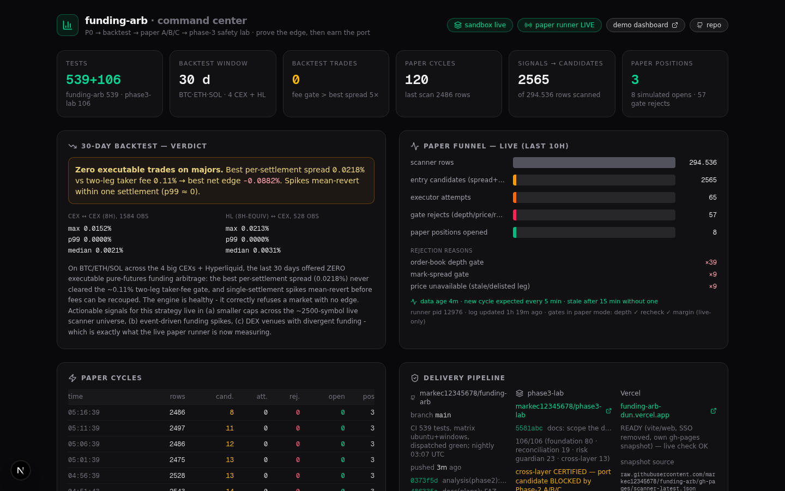
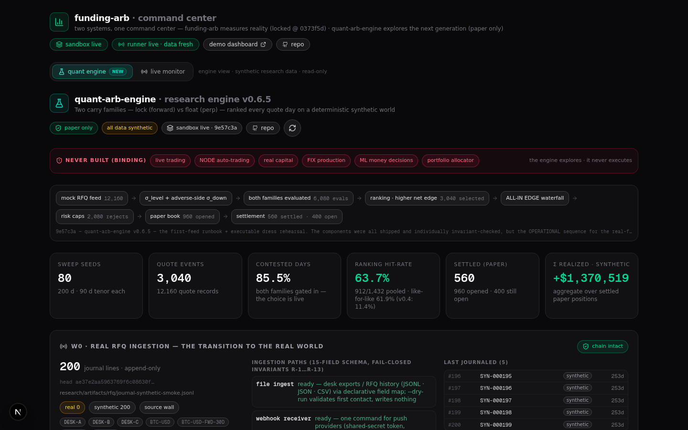

# funding-arb · command center (tower)

Live operations dashboard with **two views on one page**: the **live monitor** for the
[funding-arb](https://github.com/markec12345678/funding-arb) paper-validation pipeline
(backtest verdict, paper-trading funnel, runner health, delivery pipeline, phase-3 safety
certification — 10 s refresh) and the **quant engine view** — a read-only monitor of the
parallel [`quant-arb-engine`](https://github.com/markec12345678/quant-arb-engine) research
repo (multi-seed machinery validation, ALL-IN EDGE waterfall, NO-GO discipline).




*Built with Next.js 16 (App Router) · TypeScript · Tailwind CSS 4 · shadcn/ui.
Deployable to Vercel with zero configuration and zero environment variables.*

---

## The system it watches

This dashboard is one of four coordinated repositories:

| repo | role | state |
|---|---|---|
| [`funding-arb`](https://github.com/markec12345678/funding-arb) | the trading system — scanner, strategy, executor, gates | **locked** at `0373f5d` during Phase-2 A/B/C paper validation (539 tests, CI green) |
| [`phase3-lab`](https://github.com/markec12345678/phase3-lab) | execution-safety laboratory — 4-layer separation, formal safety gate | **certified**: 106/106 tests (foundation 80 · reconciliation 19 · risk guardian 23 · cross-layer 13), golden contract v1.1.0, PORT CANDIDATE — port blocked by Phase-2 verdict |
| [`quant-arb-engine`](https://github.com/markec12345678/quant-arb-engine) | next-gen research engine — invariant-first market-data model, ALL-IN EDGE waterfall, TWO carry families (forward lock + perp float) ranked every quote day on a deterministic mock RFQ world | **v0.4.0 · paper/research only** — trend-aware horizon σ (disclosed estimator screening + holdout confirmation, triple calibration panels, scored predictions P1..P5 with two honest refutations); monitored read-only from this tower's engine view |
| **funding-arb-tower** (this repo) | command center — reads both pipelines, never trades | runs sandbox-local and/or deployed |

The validation ladder the dashboard reflects:

```
P0 hardening ✓ → 30d backtest ✓ (0 trades, fee gate) → E2E paper-flow ✓
  → Phase 2: paper validation A/B/C          [ACTIVE — day-3 interim, day-5–7 final]
  → Phase 3: execution-safety lab            [CERTIFIED — cross-layer gate green]
  → production port of the safety layer      [BLOCKED by Phase-2 A/B/C]
  → minimal real-money test                  [pending everything above]
```

## Two data modes — one payload

`GET /api/status` returns the **same payload shape** from two very different
data planes, chosen automatically:

| | `mode: "local"` (sandbox) | `mode: "remote"` (deployed) |
|---|---|---|
| funnel · positions | read directly from the `/home/z/funding-arb` checkout (sandbox runner) | **live collector cycles + positions** from `paper-data/github-actions/*` (updated every ~5 min) |
| backtest · runner log | local files | hourly lifecycle snapshot at the `paper-data` branch root |
| runner liveness | `pgrep` + pidfile + log mtime | freshness of the collector's newest cycle on the branch |
| repo commits | local `git log` | GitHub REST API |
| latency | ~50 ms | cold ~1–6 s, then cached (60 s raw / 300 s API TTL, ETag revalidation) |

The mode is shown in the UI (`sandbox live` / `github branch` badge) and can
be forced for verification — on the API or on the whole page:

```bash
curl "http://localhost:3000/api/status?source=remote"   # API payload
open "http://localhost:3000/?source=remote"              # full dashboard in remote mode
```

The GitHub API client uses ETag conditional requests — 304 responses are free
against the rate limit — and optionally picks up a PAT from the funding-arb
git remote at runtime (sandbox only). Deployed, it runs fully unauthenticated
against public data: **no environment variables, no secrets in this repo.**

### How the remote data stays fresh

```
sandbox paper runner (5-min cycles)
   └─ journal.jsonl / positions.json ── hourly snapshot push ──► paper-data/ (branch root)
github-actions collector (repository_dispatch heartbeat, every 5 min)
   └─ live cycles + positions ─────────────────────────────► paper-data/github-actions/*
funding-arb-tower (deployed)
   └─ funnel + ledger from the collector files (live),
      backtest + log from the hourly snapshot
```

### Staleness gate (why green means the data is live)

The pipeline's weakest point is that its liveness depends on *other* things
running: the sandbox runner, the github-actions collector, and — for the
[Vercel demo](https://funding-arb-dun.vercel.app) — an **external**
cron-job.org trigger. If any of them dies, every box can still look green
while serving stale data. The dashboard therefore never infers health from
process state alone:

- `freshness.data_age_s` — the age of the **newest data point** (newest
  journal cycle). A new cycle is expected every 5 min; after 15 min without
  one the whole status pill goes **RED** (`data stale · Xm old`) even while
  the runner pid still exists. No data at all → `unknown`.
- `freshness.lifecycle_age_s` (remote) — age of the hourly sandbox lifecycle
  snapshot, tracked separately.
- `pipeline.snapshot.age_s` — age of the `gh-pages` scanner snapshot that
  feeds the Vercel demo (hourly, external cron). Stale → a red
  `SNAPSHOT STALE` badge — this is the detector for a dead cron-job.org
  schedule.

Verified both ways: lowering the thresholds makes a live-runner dashboard go
red immediately; restoring them returns it to green.

## What runs where

The repo is **portable by construction** — every sandbox-only duty is guarded
by an `existsSync("/home/z/funding-arb")` check and degrades to a no-op
elsewhere:

- `src/instrumentation-node.ts` — **paper-runner supervisor** (sandbox only):
  re-spawns the Python paper runner if it dies, records supervisor state.
  On Vercel: imported, guard fails, nothing happens.
- `src/server/gh-heartbeat.ts` — fires a `repository_dispatch "paper-cycle"`
  at GitHub at most every 5 min so the stateless github-actions collector
  runs on GitHub's own runners (sandbox only).
- `src/server/paper-snapshot.ts` — hourly durability push of the lifecycle
  dataset (journal, positions, config, logs) to the `paper-data` branch via
  git plumbing — the funding-arb working tree is never touched (sandbox only).
- `src/app/api/status/route.ts` — the status API (both modes, see above).
- `src/app/api/engine/overview/route.ts` — the quant-arb-engine monitor API (read-only;
  local sandbox checkout → GitHub raw fallback, 60 s remote cache).
- `src/app/page.tsx` — the dashboard (client component, 10 s polling) with the
  monitor/engine view switcher.
- `src/components/quant-engine/EngineView.tsx` — the engine view (60 s polling).
- `src/lib/engine-types.ts` — the engine artifact contract (shared by API + view).
- `scripts/push-paper-snapshot.sh` — the plumbing-based snapshot pusher.

## Quickstart

```bash
bun install
bun run dev        # http://localhost:3000
bun run lint       # eslint
```

Copy `.env.example` to `.env` if you want the (unused-by-this-app) Prisma
datasource wired up.

## Deploy to Vercel

1. Push this repo to GitHub (or fork it).
2. In Vercel: **Add New → Project → import the repo**.
   Framework preset **Next.js** is auto-detected; the build command is a
   plain `next build` — no environment variables needed.
3. Open the deployment: the dashboard comes up in `remote` mode
   (GitHub-branch data plane — live collector cycles) because no
   `/home/z/funding-arb` checkout exists on the serverless runtime.

That is the whole setup — the remote mode is read-only over public GitHub
data, so there is nothing to configure and nothing that can leak.

## API

### `GET /api/status[?source=remote]`

Example values below are illustrative (`12345`, `42`, …) — the real payload
carries live runtime numbers.

```jsonc
{
  "now": "…ISO…",
  "mode": "local" | "remote",
  "source": { "kind": "sandbox-live" | "github-branch", "detail": "…" },
  "freshness": {                      // the staleness gate — see above
    "data_age_s": 42,                 // age of the NEWEST journal cycle
    "expected_cycle_s": 300,
    "stale_after_s": 900,
    "stale": false,
    "status": "fresh",                // fresh | stale | unknown
    "branch_age_s": null,             // remote: paper-data tip age
    "log_age_s": 480,                 // local: runner log age
    "lifecycle_age_s": null           // remote: hourly snapshot age
  },
  "repo":   { "branch": "main", "commits": [ { "sha": "0373f5d", "message": "…" } ], "dirty": false },
  "paper": {
    "runner":  { "alive": true, "pid": 12345, "log_updated_at": "…", "log_tail": ["…"], "supervisor": { } },
    "cycles":  [ { "ts": "…", "scan_total": 2419, "candidates": 5, "opens": 1, "open_simulated": 0, "open_aborted": 1, "open_positions": 6 } ],
    "aborts":  [ { "reason": "order-book depth gate", "count": 12 } ],
    "totals":  { "cycles": 42, "scan_total": 101530, "…": "…" },
    "positions": [ { "id": "…", "base": "RVN", "long_venue": "binance", "short_venue": "bybit", "status": "open" } ]
  },
  "backtest": { "fee_gate": { "best_spread_pct": 0.0218, "…": "…" } },
  "pipeline": {
    "github":  { "repo": "markec12345678/funding-arb", "pushed_at": "…", "ci": "…" },
    "phase3":  { "latest": { "sha": "5581abc", "message": "…" }, "tests": "106/106 (…)", "status": "cross-layer CERTIFIED — port candidate BLOCKED by Phase-2 A/B/C" },
    "vercel":  { "url": "https://funding-arb-dun.vercel.app", "healthy": true },
    "snapshot":{ "source": "raw.githubusercontent.com/…/scanner-latest.json",
                 "generated_at": "…", "age_s": 1800, "expected_s": 3600,
                 "stale": false, "status": "fresh" }
  },
  "plan": [ { "step": "P0 hardening: …", "state": "done" }, { "step": "Phase 2: live paper validation A/B/C", "state": "active" } ]
}
```

## Repo layout

```
src/
  app/
    page.tsx                  # the dashboard (client, 10 s polling, view switcher)
    layout.tsx                # metadata + fonts
    api/status/route.ts       # the status API — local/remote dual data plane
    api/engine/overview/route.ts  # quant-arb-engine monitor API (read-only, dual data plane)
  components/quant-engine/
    EngineView.tsx            # the engine view — sweep stats, waterfall, NO-GO strip
  lib/
    engine-types.ts           # engine artifact contract (run-latest / sweep-latest)
  data/
    audit-findings.ts         # audit findings register (static data — the locked-repo audit)
    failure-matrix.ts          # R4 state-by-state failure matrix (21 ambiguity cells + root causes)
  server/
    gh-heartbeat.ts           # 5-min repository_dispatch heartbeat (sandbox-only)
    paper-snapshot.ts         # hourly paper-data push (sandbox-only)
  instrumentation-node.ts     # paper-runner supervisor (sandbox-only, guarded)
scripts/
  push-paper-snapshot.sh      # git-plumbing snapshot pusher
db/  prisma/                  # INERT template scaffolding — no route imports
                              # @/lib/db; delete freely (kept only because the
                              # sandbox tooling references it)
```

> **Note on Prisma:** the dashboard itself never touches a database — it is a
> read-only observer over files, git and the GitHub API. The `db/`, `prisma/`
> directories, the `@prisma/client` dependency and the `db:*` scripts are
> leftover scaffolding from the underlying Next.js template and can be
> removed without affecting anything. The "zero configuration" claim refers
> to the running app: no route reads `DATABASE_URL`.

## Status

- funding-arb: **locked at `0373f5d`**, paper validation running (Phase 2).
- phase3-lab: **cross-layer certification COMPLETE** — port candidate.
- Production port: **BLOCKED until the Phase-2 A/B/C verdict**.
- This dashboard: runs sandbox-local, deploys to Vercel unconfigured.

## Audit findings register

The dashboard renders the read-only audit findings for the locked
[`funding-arb`](https://github.com/markec12345678/funding-arb) repo (`0373f5d`) in the
"Audit findings" card: severity-ranked findings (P0–P3) with live counts derived from
`src/data/audit-findings.ts`, per-finding status (`confirmed` / `deferred`), and the
audit round each finding came from. The full evidence register lives at
`docs/funding-arb-audit.md` (added separately). The repo stays locked during the
Phase-2 A/B/C measurement — findings are recorded only, the measured system is
untouched, and remediation is deferred to the post-Phase-2 hardening pass.

Rounds: R1 API surface · R2 watcher · R3 executor/runner · R4 failure matrix ·
R5 targeted integrity audit (config/experiment/concurrency plane — 7 findings:
orchestrator duplicate gate, watcher config split, fail-open funding-recheck
code default *amended in R6: the template overrides it — capability, not active*,
silent strategy-config defaults, unlocked config invariant, non-durable atomic write,
multi-process TOCTOU) · **R6 measurement-validity audit** (PnL instrument / gates /
data-quality — 5 findings + 3 re-confirmations: paper PnL excludes realized funding
cashflow, recheck verifies raw spread not net edge, funding-based exit vs price-based
PnL, failed mark price cached as 0, four economic truths) · **R7 economic-invariants
audit** (funding math / quantity-notional / price-source — 4 findings: the price named
“mark price” is the futures ticker/last price, trade_usd is not the notional of either
leg, ledger trade_usd stays the requested value, cross-interval spread is
min(interval)-normalized — an edge model, not settlement cashflow) · **R8 red-team closure
audit** (sign convention / fee double-counting / quantity chain — two checks closed
clean, the sign check found the last correctness defect: the spread-PnL instrument's
abs()+direction-sign convention is not the position's mark-to-market — 5/12 closes
mis-signed, corrected reading −0.313% attributable / −0.150% data-gap / −0.463% raw). R5's headline empirical
result: across 261 real cycles the journal carries exactly one thresholds variant and
trade_usd never leaves 500 — for every recorded dimension the Phase-2 sample
**is one experiment (verified)**. R6's headline: the excluded funding component for
the attributable closes is ≈ +1.0 % to +1.6 % (2–4× the measured −0.42 % spread PnL,
opposite sign) — so the primary result is labeled **strategy-attributable paper
SPREAD PnL** with "realized funding cashflow not observed in paper mode" stamped
alongside, never as funding-arbitrage profitability. R7's headline: the rigorous
per-leg re-measure (notional × rate × held/interval per leg) **confirms the funding
materiality at the upper bound (+1.599 %)** and shows round-trip fees consume nearly
all of it — the economic estimate reads −0.39 %, carried strictly as a diagnostic,
never as a Phase-2 PnL instrument. R8's headline: **audit complete** — the funding
sign convention is mechanically correct in every reachable combination, fees are
counted exactly once, the quantity chain is consistent 15/15 — and the spread-PnL
instrument itself mis-signs 5/12 closes (NEW-20); the corrected signed reading is
−0.313 % attributable, and the final A/B/C report carries it as the corrected
spread-PnL view.

## Exit classification — strategy-attributable vs E-04

The "exit classification" card is the passive evidence layer for the Phase-2
A/B/C verdict: every paper close is classified by cause — genuine edge
collapse · PnL stop-loss · funding condition · manual/system safety ·
**E-04 data-gap (edge=-999)**. PnL per exit mirrors the watcher's
`estimate_spread_pnl` formula with close prices from the executor's own leg
fetch (independent of the scanner gap). Read-only by design:
`src/server/exit-classification.ts` only reads the journal + positions ledger
— the runner and the measured system are untouched.

**Reporting contract (final A/B/C report):** the **strategy-attributable**
result (genuine strategy exits, data-gap held apart) is the **primary**
number; the **raw** result and the **E-04 contamination** split are always
shown alongside — never a single blended PnL. The card enforces this
hierarchy: primary panel first, then the raw + contamination decomposition,
an inline **attribution check** (strategy-attributable + contamination =
raw, verified with ✓/✗ on the rendered totals), and a **survival** line
(opened positions → closed genuine · closed data-gap · still open) — so
"how many opens survive to a normal close" is a live dashboard number.

Current finding: the raw near-zero exit PnL is an artifact — genuine
strategy exits and E-04 data-gap exits pull in opposite directions, so the
verdict must read both views. R8 amendment (NEW-20): under the signed
mark-to-market arithmetic both groups read negative (−0.313 % / −0.150 %) and
the raw is −0.463 % — the "PnL-directional contamination" was largely a
sign-convention artifact of the instrument (abs spread + direction sign,
which mis-signs a close whenever the price relationship disagrees with the
funding-direction label or crosses zero). The exit-classification card now
renders **both readings** (instrument mirror + signed corrected) with a
per-exit signed column; the final A/B/C report carries the signed reading
as the corrected spread-PnL view.

## Economic decomposition — R7 invariant test (diagnostic)

The "economic decomposition" card is the read-only mathematical invariant test
from review round 7 (`src/server/economic-invariants.ts`): for every closed
position it joins the ledger row, the open action's entry scanner row and the
close action's executed legs, then verifies the eight invariant dimensions
A–H (requested notional · actual per-leg notionals · price source · rate
source · per-leg interval · settlements inside the hold · estimated funding
cashflow per leg) and writes out the decomposition identity per close:

> economic estimate = spread PnL + funding leg long + funding leg short − fees

Every component is computed from the **actual per-leg notionals** (NEW-17/NEW-18
applied), funding accrues linearly with a settlement-count variant as the
stricter bound, and prices are labeled what they are — futures ticker/last
(NEW-16). On the current sample (12/12 closes A–H complete): spread −0.425 % +
estimated funding +1.599 % − fees 1.567 % = **economic estimate −0.393 %**
(−$2.12 + $7.99 − $7.83 = −$1.96), with the identity ✓ built to hold on the
displayed numbers. The test answers the one question it was built for: the R6
two-point materiality estimate was of the right magnitude — the per-leg
computation lands on its upper bound. **Scope guard, enforced in the labels:
diagnostic only, never a Phase-2 PnL instrument** — execution measurement
(spread PnL) and funding economics (estimated, not realized) remain separate
reported components of the final A/B/C report.

## Failure matrix (R4)

Below the register, the "Failure matrix" card renders the state-by-state
walkthrough (`src/data/failure-matrix.ts`): 21 ambiguity cells across three
groups (ORDER SUBMITTED ×9, POSITION ×6, RECOVERY ×6), each with a verdict —
`safe` (exactly one safe state transition), `ambiguous`, or `gap` (no safe
transition) — traced to code at the locked commit, cross-referenced to register
findings, plus the five cross-cutting root causes (M-01…M-05) that block
multiple cells. This is the Phase-2 evidence baseline: it proves where the
execution routing is deterministic and maps exactly where the Phase-3
fail-closed contract is not yet met. The audit phase is **closed** (review
decision): no further blind bug-hunting — the register + matrix are the
complete pre-change audit trail, the refined hardening-pass plan
(M-01+M-05 as one submit contract, M-02+M-03 as one safety combination,
M-04 terminal state machine) and the re-run-the-matrix regression proof
live in `docs/funding-arb-audit.md` ("R4 closure").

## Quant engine view — the parallel research track, monitored

The **quant engine** tab (default on load) is the tower's read-only window into
`quant-arb-engine` — the sibling repo that explores the carry question on a
deterministic synthetic world, with **two strategy families ranked every quote
day** (v0.3.0): `forward_basis_v1` (lock the carry through a dated forward) vs
`perp_carry_v1` (float it on a short CEX perp). As of **v0.4.0** the horizon
σ is TREND-AWARE (dispersion + |β̂|·H/2 trend-continuation exposure — one σ,
one meaning everywhere). It renders exactly what the engine's research
artifacts carry, with the engine's own epistemic note traveling with the data:

- **Machinery validation (60-seed sweep: screening 1..40 + holdout 41..60)** —
  pooled PnL distribution plus per-family diagnostics: realized−locked bps (the
  forward lock through settlement, ≈ −exit crossing) and accrual−expected bps
  (floating carry vs its ex-ante estimate); risk-cap reject histogram; per-seed
  realized PnL chart + table (contested / selected / opened / settled columns).
- **Triple σ calibration panels** — σ_level (the v0.2.0 finding, kept for audit:
  68.3 % breach) next to σ_H-iid (the v0.3.0 finding, kept for audit: 35.5 %)
  next to the v0.4.0 redefined trend-aware σ_H (11.0 % vs the 4.55 % nominal)
  — each panel with an **entry-history decomposition** (≤ 45 observed days:
  15.0 % vs > 45 days: 0.8 % — the residual is early-history uncertainty), a
  **holdout confirmation** strip (screening 10.4 % vs holdout 12.1 % — the
  estimator generalizes), and the **disclosed estimator screening** (4
  candidates measured on the frozen v0.3 journals; HAC/Newey–West REJECTED at
  73.2 % — the textbook fix is the wrong estimand for a drifting level).
- **Scored predictions P1..P5** — the falsifiable statements written in the
  engine's decision record BEFORE any v0.4 run, scored by the sweep as
  measured. P3 and P4 are REFUTED and rendered as honest findings — P4 is the
  round's headline: the honest two-sided trend buffer flips the ranking to the
  locked forward and the ex-post scorecard prices that conservatism (hit-rate
  60.2 % → 11.4 %); the asymmetric-buffer question is recorded for v0.5
  pre-registration, not patched (STOP RULE against estimator fishing).
- **World v2 — the synthetic regime** — the journaled daily printed funding
  APR (carry curve) with the ramp 8 % → 18 % and collapse 18 % → 4 % phases
  marked: the two-sided world where the instrument question exists.
- **Ranking layer — instrument choice** — hit-rate on full-window contested
  days, the selection timeline per quote day, forward's share of contests by
  phase (92 % build-up → 96 % collapse in v0.4), and the family census table.
- **Latest run (end-to-end)** — the representative seed's funnel (family
  evals → contested → selected → opened → settled), settled positions of both
  families (locked premium or printed funding accrual + error vs expectation),
  and the verbatim unit rule.
- **ALL-IN EDGE waterfall** — the last executed opportunity (either family,
  with what it was ranked over) decomposed line by line (gross → entry/exit
  fees → carry σ buffer → slippage → execution risk → net), with the gates
  shown at their actual values and both sigmas displayed with their meanings
  (the trend-aware gate σ next to the v0.3 iid audit value).
- **NO-GO strip (binding)** — live trading, NODE auto-trading, real capital,
  FIX production, ML money decisions, portfolio allocator: never built.

`GET /api/engine/overview` follows the same dual data plane as `/api/status`:
local sandbox checkout (`/home/z/quant-arb-engine`, read directly, includes
uncommitted sweeps) → GitHub raw fallback (`raw.githubusercontent.com/…/
research/artifacts/{run,sweep}-latest.json`, 60 s local-memory cache). The
tower never writes to the engine, never triggers runs, holds no engine state.

## Parallel research track — Wintermute NODE (plan only, no code)

A deep analysis + build plan for the **Wintermute NODE** OTC platform
(`trade.wintermute.com`, the destination of the trade-login link) lives in
[`docs/wintermute-node-analysis.md`](./docs/wintermute-node-analysis.md):
what the platform is (spot / dated forwards / NDFs / CFDs / options / tailored —
**no perpetual swaps**, zero fees, all cost in the quoted spread, est. $100k–250k
minimums), whether it makes sense for bigger earnings (verdict: **conditional yes** —
three measurable routes: scale execution, forward basis-lock, options-based yield),
and a phased plan (W0 qualification → W1 zero-capital RFQ measurement → W2
pre-registered strategy gate → W3 defined-risk pilot) with kill criteria and the
audit’s measurement invariants (NEW-16/17/18/20 → I-1…I-6) carried into the new
journal schema. Research-only: funding-arb stays locked at `0373f5d`, the tower stays
read-only, no capital before the W2 gate.

**Decision recorded 2026-09-11 (§0 of the doc):** the W0–W4 track is adopted; Route B
(implied-carry vs forward-price scanner: CEX funding observations → implied carry →
forward RFQ quote → compare → all-in edge) is the primary research direction and the
seed of a long-term multi-strategy arbitrage/quant engine. Canonical result phrasing:
*on the current sample and reconstruction there is no proof of a positive edge* (the
−0.281% figure is a diagnostic aggregate — −$1.41 total across the 7 attributable
closes, ≈ −$0.20 per $500 cycle).

## Disclaimer

Educational / research tooling around funding-rate arbitrage — not financial
advice. The dashboard is strictly read-only: it observes the pipeline, it
never places, simulates or approves trades.
